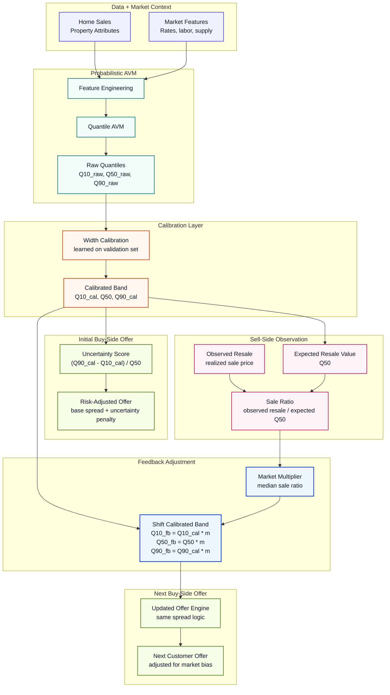
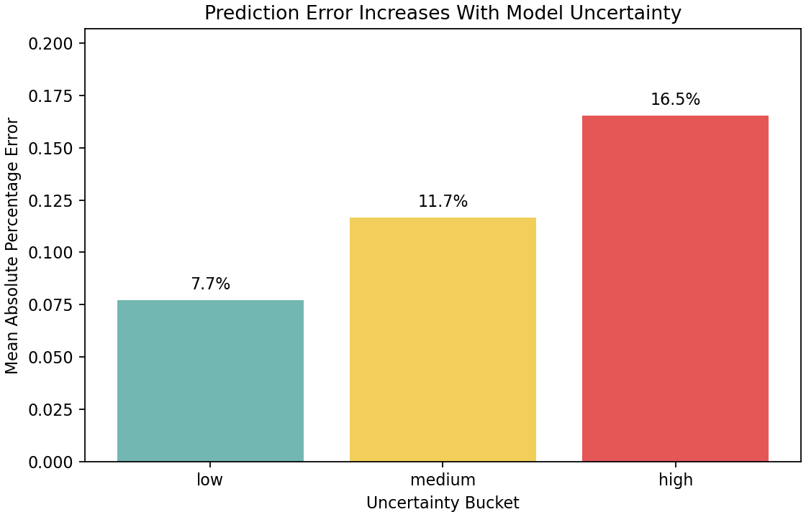
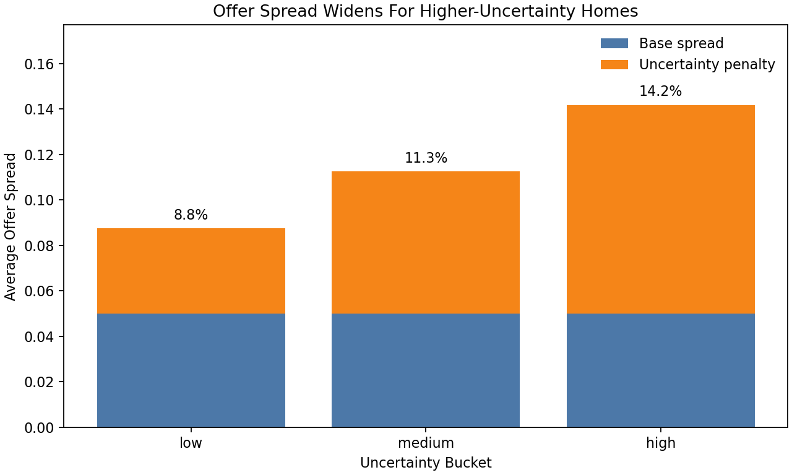

[](your-substack-link)

# Risk-Aware Home Pricing Engine

A probabilistic pricing system for real estate acquisition decisions. The project moves beyond a single home-value prediction by estimating valuation uncertainty, converting that uncertainty into a dynamic offer spread, and using realized resale outcomes to adjust future offers.

Start with `main.py` to run the full pipeline. The core model and pricing logic live in `3_risk_adjusted_pricing.py`.

```text
Point AVM:      What is this home worth?
Risk-aware AVM: What is it worth, how uncertain are we, and how should that change the offer?
```

## System Overview

```mermaid
flowchart LR
    A["Data<br/>Home + Market Features"]
    B["Quantile AVM<br/>Q10, Q50, Q90"]
    C["Width Calibration<br/>Reliable Q10-Q90 Band"]
    D["Buy Offer Engine<br/>Q50 - Base Spread - Risk Penalty"]
    E["Sell-Side Outcomes<br/>Realized Resale"]
    F["Market Multiplier<br/>Median Resale / Expected Q50"]
    G["Next Offers<br/>Quantiles shifted by multiplier"]

    A --> B --> C --> D
    C --> E
    E --> F
    F --> G
    C --> G
    G --> D

    classDef data fill:#EEF2FF,stroke:#4F46E5,stroke-width:1.5px,color:#111827
    classDef model fill:#F0FDFA,stroke:#0F766E,stroke-width:1.5px,color:#111827
    classDef calibration fill:#FFF7ED,stroke:#C2410C,stroke-width:1.5px,color:#111827
    classDef offer fill:#F7FEE7,stroke:#4D7C0F,stroke-width:1.5px,color:#111827
    classDef sell fill:#FDF2F8,stroke:#BE185D,stroke-width:1.5px,color:#111827
    classDef feedback fill:#EFF6FF,stroke:#1D4ED8,stroke-width:2px,color:#111827

    class A data
    class B model
    class C calibration
    class D,G offer
    class E sell
    class F feedback
```



## Detailed End-To-End Flow



The feedback loop does not retrain the AVM or change model parameters. It applies a post-calibration market-level correction:

```text
Raw quantiles
-> width-calibrated quantiles
-> sell-side market multiplier
-> feedback-adjusted quantiles
-> next buy offer
```

```text
Width calibration = property-level uncertainty reliability
Market multiplier = market-level bias correction
```

## Why This Project Exists

In acquisition pricing, the model is not only predicting value. It is deciding how much capital to put at risk. A traditional point-estimate AVM can say two homes are both worth `$500K`, but it does not say whether one estimate is much less reliable than the other.

This project treats pricing as a decision under uncertainty:

- `Q50` estimates fair market value.
- `Q10` and `Q90` define a valuation range.
- The calibrated `Q10-Q90` width becomes a risk signal.
- Wider uncertainty creates a larger offer spread or a manual-review flag.
- Recent resale outcomes feed back into future offers through a market multiplier.

## Technical Approach

The main model is a LightGBM quantile regression AVM trained with a chronological split. The pipeline includes:

- Time-based train / validation / test split to mimic future pricing.
- Feature engineering for age, renovation, size, layout, quality, seasonality, location, and market context.
- Leakage-safe zipcode target encoding.
- Hyperparameter tuning using pinball loss and interval reliability.
- Quantile predictions for `Q10`, `Q50`, and `Q90`.
- Validation-based width calibration so the prediction interval is reliable enough to use in pricing.
- Rolling feedback loop that updates future offers from recent resale performance.

## Results

| Area | Result |
|---|---:|
| Q50 MAPE | `11.97%` |
| Calibrated Q10-Q90 coverage | `80.3%` |
| Target Q10-Q90 coverage | `80.0%` |
| Avg offer / Q50 | `88.61%` |
| Homes routed to max-uncertainty review | `13.1%` |

## Uncertainty Mapped To Risk

Higher model uncertainty corresponded to higher realized pricing error, which supports using prediction interval width as an offer-risk signal.

| Bucket | Avg Error |
|---|---:|
| Low uncertainty | `7.71%` |
| Medium uncertainty | `11.66%` |
| High uncertainty | `16.55%` |



## Risk-Adjusted Offer Engine

The offer engine starts with `Q50` as fair value, then subtracts a base spread and an uncertainty penalty.

```text
uncertainty_score = (calibrated_Q90 - calibrated_Q10) / Q50
uncertainty_penalty = min(penalty_strength * uncertainty_score, max_penalty)
buy_offer = Q50 * (1 - base_spread - uncertainty_penalty)
```

Current policy settings:

| Parameter | Value |
|---|---:|
| Base spread | `5.0%` |
| Penalty strength | `0.15` |
| Max uncertainty penalty | `10.0%` |
| Average total spread | `11.39%` |



## Feedback Loop

The feedback loop compares realized resale outcomes against the model's expected value. If recent homes sell below expected value, the multiplier moves below `1.0` and future offers become more conservative. If recent homes sell above expected value, the multiplier can increase future offers to remain competitive.

```text
sale_ratio = realized_sale_price / expected_q50
market_multiplier = median(recent sale ratios)
feedback_adjusted_quantiles = calibrated_quantiles * market_multiplier
```

## Downside Stress-Test Value

Under downside market shocks, the feedback loop lowered future offers and improved the P&L proxy versus a no-feedback baseline.

| Scenario | Overpay Rate: Baseline -> Feedback | P&L Proxy Improvement |
|---|---:|---:|
| 5% downside | `20.22% -> 16.63%` | `+$43.8M` |
| 10% downside | `35.07% -> 17.81%` | `+$139.7M` |
| 15% downside | `53.94% -> 18.99%` | `+$235.5M` |


## Code Structure

| File | Purpose |
|---|---|
| `main.py` | Runs the full numbered pipeline end to end |
| `1_king_county_eda.py` | Data and market environment study |
| `2_point_avm_baseline.py` | Traditional point-model baseline |
| `3_risk_adjusted_pricing.py` | Main quantile AVM and offer engine |
| `4_quantile_calibration.py` | Width-based interval calibration |
| `5_calibration_method_comparison.py` | Width vs isotonic calibration comparison |
| `6_sell_side_feedback_loop.py` | Scenario-based feedback loop |
| `7_realtime_feedback_backtest.py` | Rolling feedback backtest |
| `8_downside_stress_feedback_backtest.py` | Downside stress feedback analysis |

## How To Run

```bash
pip install -r requirements.txt
python main.py
```

Useful shortcuts:

```bash
python main.py --list
python main.py --from-step 3 --to-step 3
python main.py --from-step 6
```

The core pricing system can also be run directly:

```bash
python 3_risk_adjusted_pricing.py
```

## Key Outputs

- `outputs/3_model_diagnostics/model_summary_metrics.csv`
- `outputs/3_model_diagnostics/calibration_check.png`
- `outputs/3_offer_engine/buy_offer_recommendations.csv`
- `outputs/3_offer_engine/manual_review_candidate_report.md`
- `outputs/7_realtime_feedback/realtime_feedback_report.md`
- `outputs/8_downside_stress_feedback/downside_stress_feedback_report.md`

## Takeaway

The model is not only trying to predict home prices. It is designed to make better acquisition decisions under uncertainty by linking model confidence, pricing strategy, and observed resale performance.
