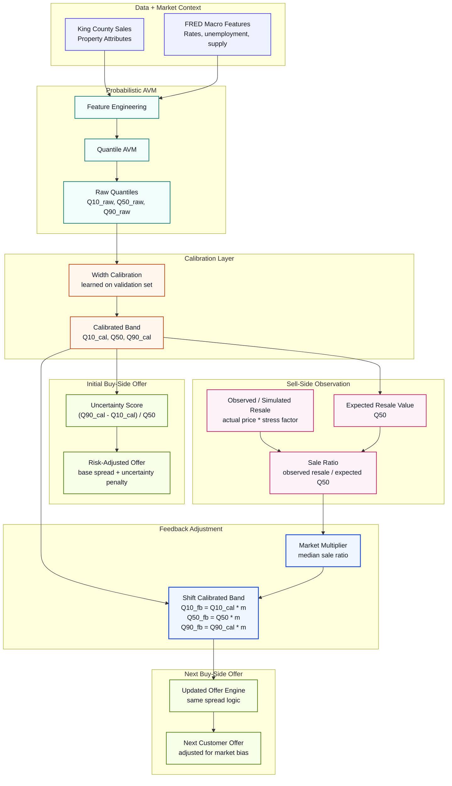

# Sell-Side Feedback Loop Diagram



## Key Interpretation

The feedback loop does **not** retrain the AVM and does **not** change raw model
parameters. It applies a post-calibration market-level correction:

```text
Raw quantiles
-> width-calibrated quantiles
-> sell-side market multiplier
-> feedback-adjusted quantiles
-> next buy offer
```

This keeps the two corrections separate:

```text
Width calibration = property-level uncertainty reliability
Market multiplier = market-level bias correction
```
