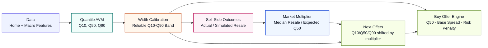

# Compact Feedback Loop Diagram


```mermaid
flowchart LR
    A["Data<br/>Home + Macro Features"]
    B["Quantile AVM<br/>Q10, Q50, Q90"]
    C["Width Calibration<br/>Reliable Q10-Q90 Band"]
    D["Buy Offer Engine<br/>Q50 - Base Spread - Risk Penalty"]
    E["Sell-Side Outcomes<br/>Actual / Simulated Resale"]
    F["Market Multiplier<br/>Median Resale / Expected Q50"]
    G["Next Offers<br/>Q10/Q50/Q90 shifted by multiplier"]

    A --> B --> C --> D
    C --> E
    E --> F
    F --> G
    C --> G
    G --> D

    classDef data fill:#EEF2FF,stroke:#4F46E5,stroke-width:1.5px,color:#111827
    classDef model fill:#F0FDFA,stroke:#0F766E,stroke-width:1.5px,color:#111827
    classDef calibration fill:#FFF7ED,stroke:#C2410C,stroke-width:1.5px,color:#111827
    classDef offer fill:#F7FEE7,stroke:#4D7C0F,stroke-width:1.5px,color:#111827
    classDef sell fill:#FDF2F8,stroke:#BE185D,stroke-width:1.5px,color:#111827
    classDef feedback fill:#EFF6FF,stroke:#1D4ED8,stroke-width:2px,color:#111827

    class A data
    class B model
    class C calibration
    class D,G offer
    class E sell
    class F feedback
```

## Slide Takeaway

```text
Model uncertainty sets the risk spread.
Sell-side outcomes set the market multiplier.
The next offer uses both.
```
