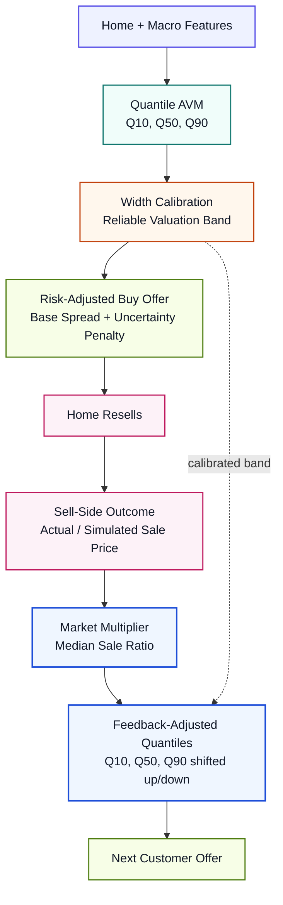

# Vertical Feedback Loop Diagram



## Slide Takeaway

```text
The AVM estimates value and uncertainty.
The offer engine prices that uncertainty.
Sell-side outcomes shift the next valuation band through a market multiplier.
```
