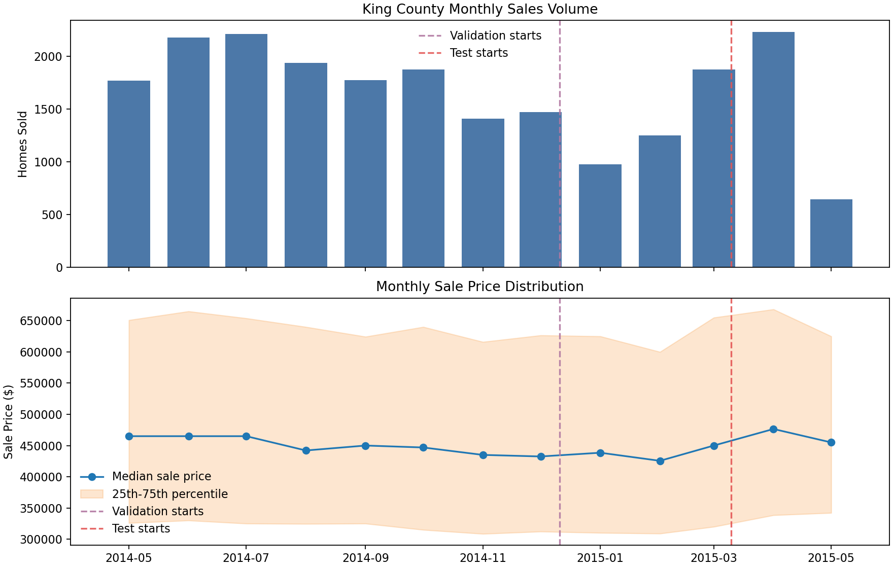
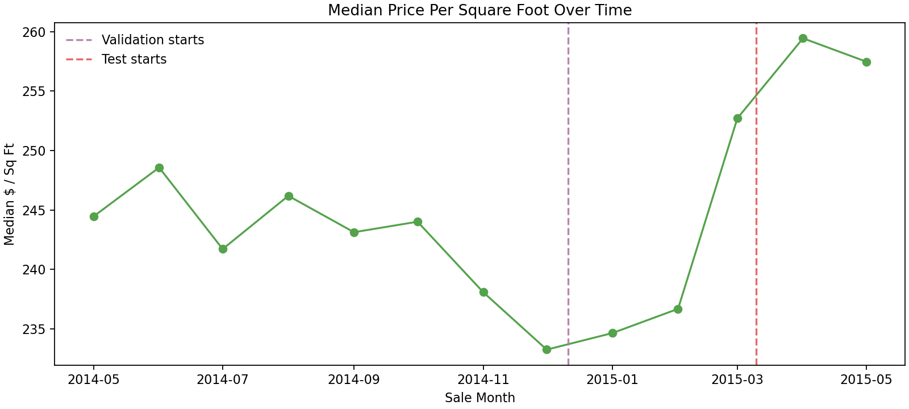
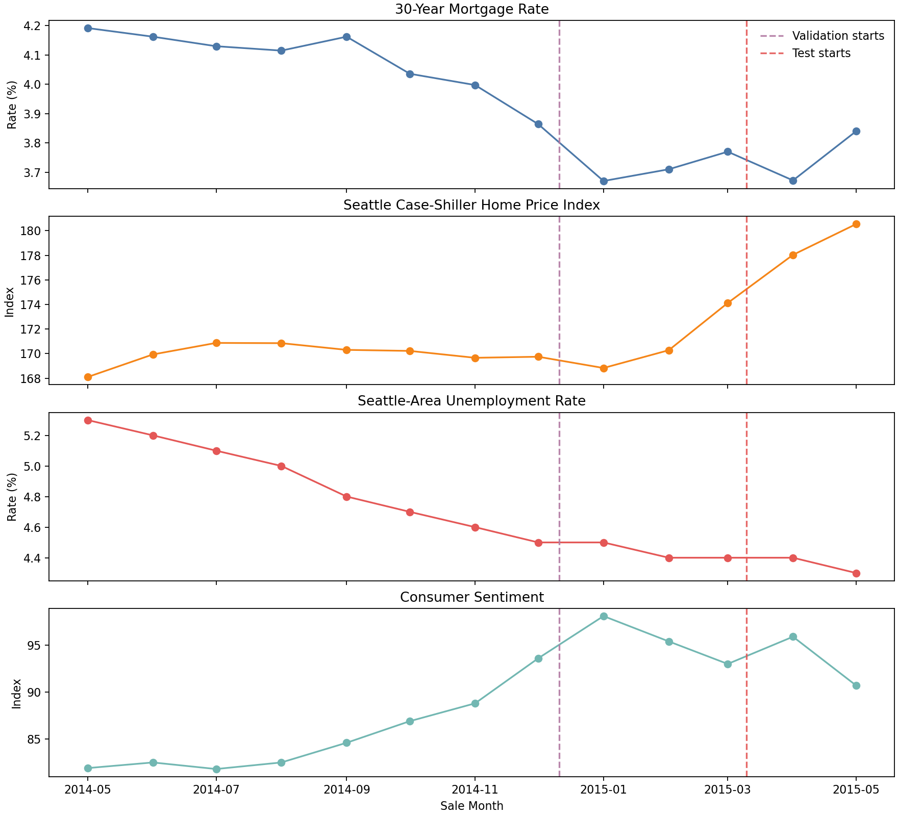
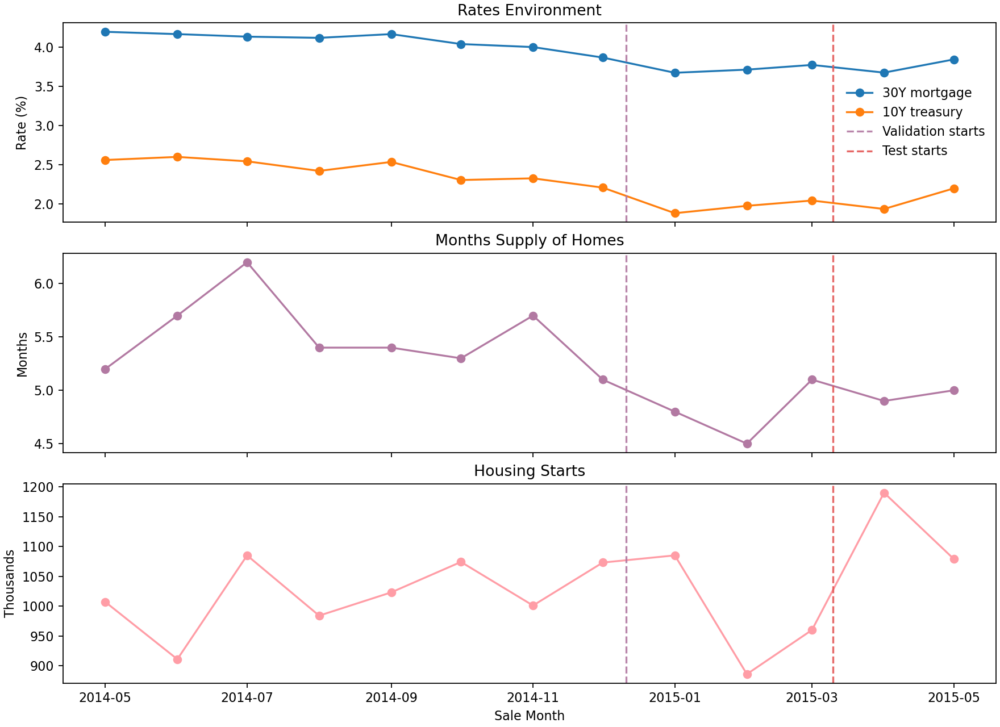
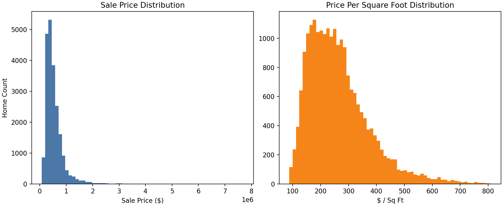
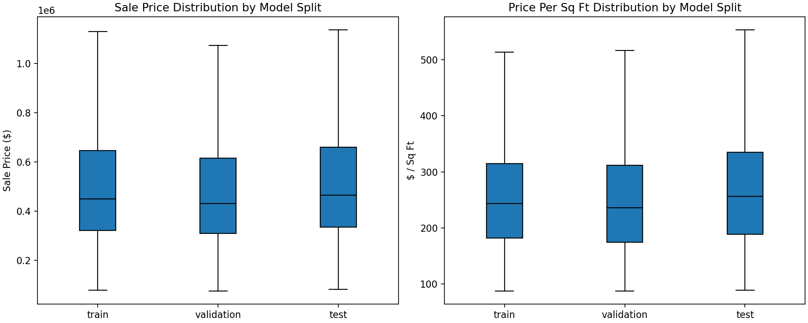
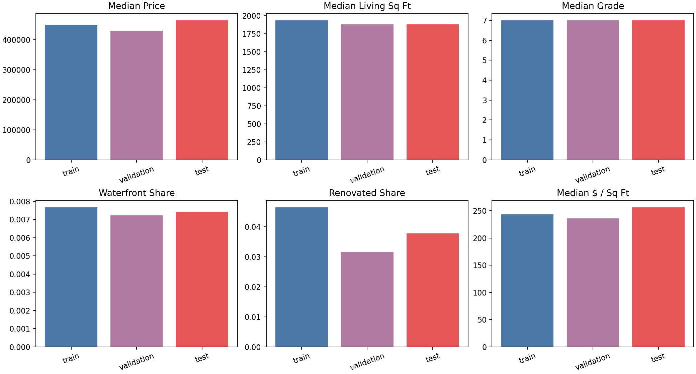
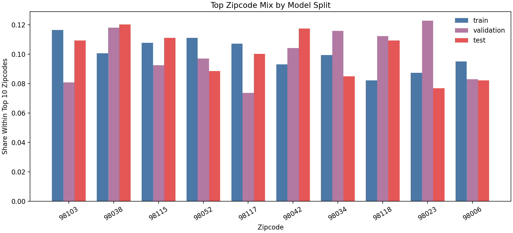

# King County Housing And Macro EDA

This pre-study uses the full King County dataset and the attached FRED macro
features before the probabilistic AVM is trained.

## Dataset Window

- Sale window: `2014-05-02` to `2015-05-27`
- Homes: `21,613`
- Median sale price: `$450,000`
- Median price per square foot: `$245`

The model split is time based:

| Split | Start | End | Homes | Median Price | Median $/Sq Ft |
|---|---:|---:|---:|---:|---:|
| Train | 2014-05-02 | 2014-12-11 | 13,832 | $450,000 | $244 |
| Validation | 2014-12-11 | 2015-03-10 | 3,458 | $430,000 | $236 |
| Test | 2015-03-10 | 2015-05-27 | 4,323 | $465,000 | $256 |

Vertical dashed lines in the time-series plots mark:

- Validation start: `2014-12-11`
- Test start: `2015-03-10`

## Sales And Price Movement

Major understanding: sale volume is seasonal, while price per square foot rises
into the test period. Median price per square foot moves from about
`$244` to `$257`, a
`5.3%` change over the dataset window.

## Macro Environment

Major understanding: the macro backdrop becomes more supportive for housing over
the sample. The 30-year mortgage rate moves from `4.19%` to
`3.84%`, while the Seattle Case-Shiller index changes by
`7.4%`.

## Home Distribution And Split Mix

The raw price distribution is right-skewed, which explains why RMSE can look
large: luxury and unusual homes create large dollar errors.

Major understanding: train, validation, and test periods are similar enough to
model, but not identical. The time-based test period has a stronger price-per-
square-foot environment and a potentially different geographic/property mix.
That helps explain why a static model trained on earlier sales can underpredict
later prices.

## Why This Matters For The Pricing Project

This EDA supports two modeling choices:

1. A time-based split is appropriate because pricing future homes from historical
   sales is the real operating problem.
2. Macro and sale-month features matter because the test period occurs in a
   changing price environment.

It also motivates the later feedback-loop idea: even a strong AVM can become
systematically biased when the market level changes between acquisition and
resale.
