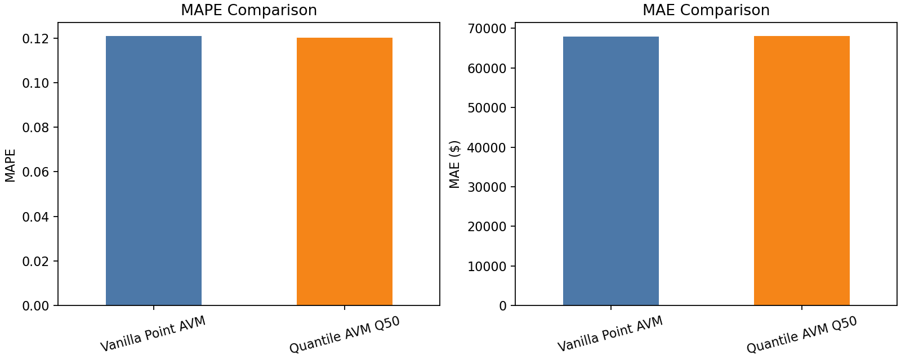
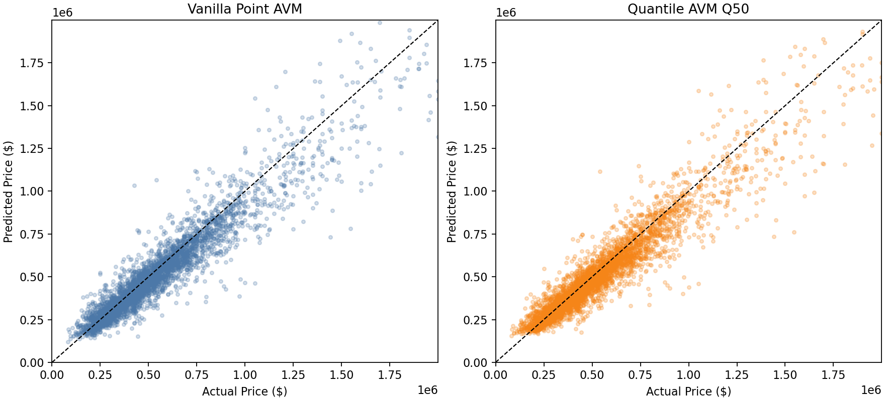

# Vanilla Point AVM vs Quantile AVM Q50

This comparison checks whether the probabilistic AVM gives up too much point
prediction accuracy compared with a standard regression AVM.

Both models use the same King County + FRED feature pipeline and the same
time-based train/test split.

## Why This Comparison Matters

The quantile AVM is valuable because it produces uncertainty bands. But if its
median prediction is much worse than a standard point model, a production design
might use:

```text
point model -> fair value
quantile model -> uncertainty band
offer engine -> combines both
```

If Q50 is competitive, the simpler probabilistic architecture is easier to
defend.

## Metric Comparison

|                   |        mae |   mape |   median_ape |        rmse |
|:------------------|-----------:|-------:|-------------:|------------:|
| Vanilla Point AVM | 68001.8381 | 0.1209 |       0.0898 | 118805.0019 |
| Quantile AVM Q50  | 68080.6399 | 0.1201 |       0.0884 | 124822.4149 |





## Takeaway

The two models are very close on normalized point accuracy.

MAPE difference, defined as `point_mape - q50_mape`, is `0.0008`.
A negative value means the vanilla point AVM is better; a positive value means
the quantile Q50 is better.

## Best Point AVM Parameters

```text
n_estimators         500.00
learning_rate          0.05
num_leaves            31.00
min_child_samples     80.00
subsample              0.90
colsample_bytree       0.90
```

## Best Quantile AVM Parameters

```text
n_estimators         700.000
learning_rate          0.035
num_leaves            31.000
min_child_samples     80.000
subsample              0.900
colsample_bytree       0.900
```

