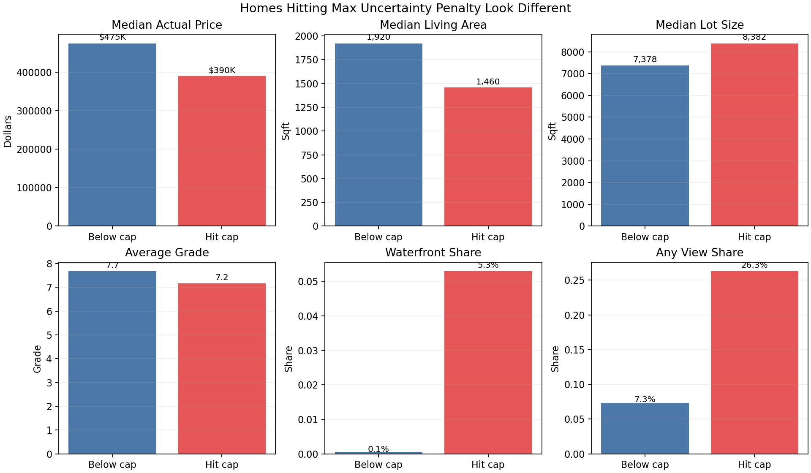

# Manual Review Candidate Analysis

The offer engine caps the uncertainty penalty at 10%. Homes that hit this cap
are useful to inspect because they may be better suited for manual review than
fully automated pricing.

## Headline

| Metric | Below Cap | Hit Cap |
|---|---:|---:|
| Home count | 3756 | 567 |
| Share of test set | 86.9% | 13.1% |
| Avg uncertainty score | 39.0% | 86.0% |
| Median actual price | $475,000 | $390,000 |
| Median living area | 1,920 sqft | 1,460 sqft |
| Median lot size | 7,378 sqft | 8,382 sqft |
| Average grade | 7.68 | 7.17 |
| Waterfront share | 0.1% | 5.3% |
| Any-view share | 7.3% | 26.3% |

## Interpretation

The max-penalty homes are the cases where the model's calibrated uncertainty
would imply an even larger penalty, but the business policy caps the discount.
That makes them natural candidates for a manual review queue, a more detailed
inspection workflow, or a no-instant-offer rule.

## Top Zipcodes Among Capped Homes

|   zipcode |   capped_home_count |   median_actual_price |   median_sqft_living |   average_uncertainty_score |
|----------:|--------------------:|----------------------:|---------------------:|----------------------------:|
|     98118 |                  66 |       386000          |               1480   |                    0.895313 |
|     98146 |                  33 |       333500          |               1460   |                    0.896901 |
|     98168 |                  26 |       231975          |               1125   |                    0.867327 |
|     98178 |                  23 |       254500          |               1360   |                    0.888665 |
|     98055 |                  17 |       277000          |               1350   |                    0.940726 |
|     98198 |                  17 |       220000          |               1060   |                    0.918514 |
|     98106 |                  16 |       265500          |               1089.5 |                    0.845782 |
|     98056 |                  16 |       280500          |               1505   |                    0.802353 |
|     98126 |                  15 |       390000          |               1140   |                    0.804565 |
|     98040 |                  15 |            1.37e+06   |               3510   |                    0.768824 |
|     98042 |                  14 |       385000          |               2030   |                    0.781016 |
|     98112 |                  14 |            1.6465e+06 |               3375   |                    0.750232 |
|     98166 |                  12 |       336250          |               1295   |                    0.987473 |
|     98038 |                  12 |       628975          |               2785   |                    0.820185 |
|     98033 |                  12 |       895000          |               2510   |                    0.761273 |
