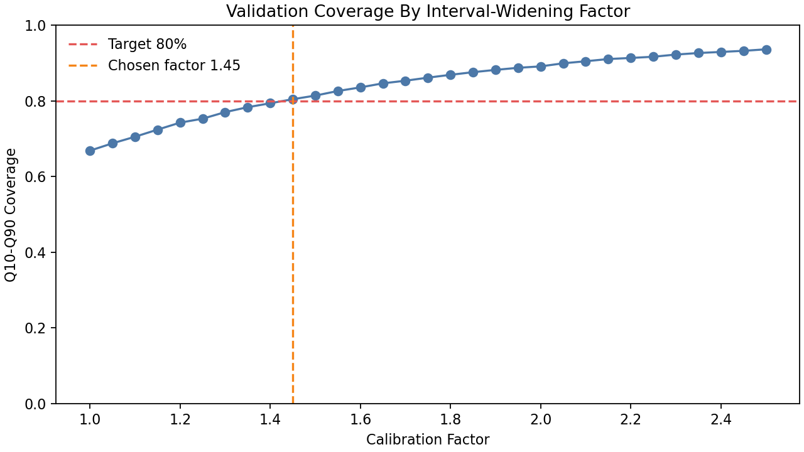
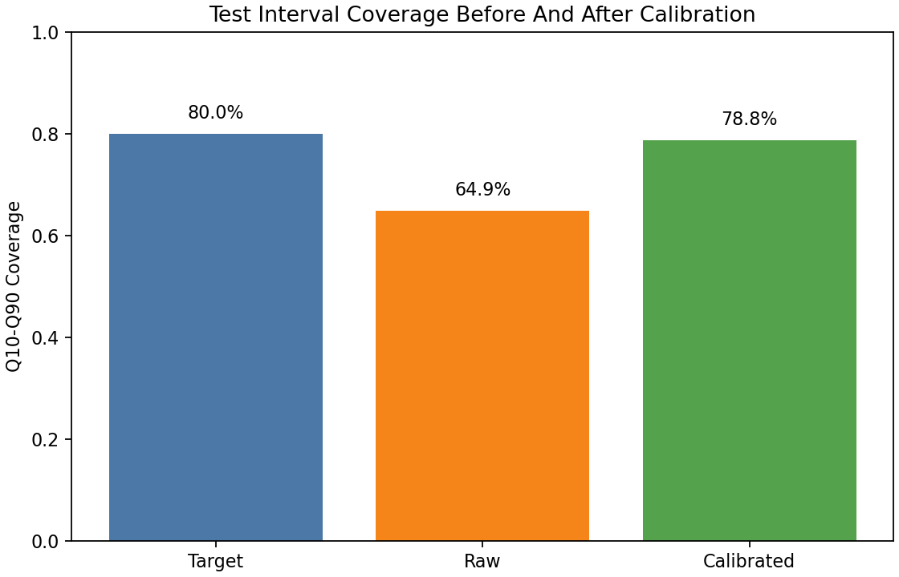
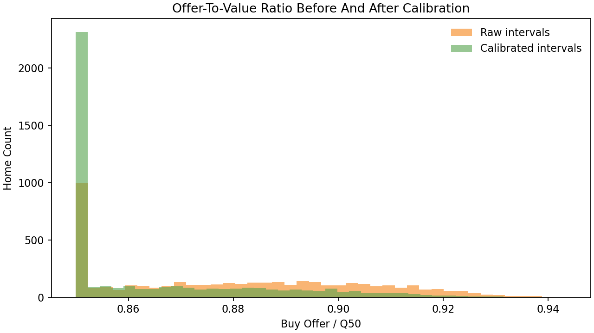

# Quantile Interval Calibration

This step calibrates the raw `Q10-Q90` interval before using interval width in
the buy-offer engine.

## Why Calibration Is Needed

The quantile AVM's `Q50` is competitive as a fair-value estimate, but the raw
`Q10-Q90` interval is under-covered. That means the model is overconfident:
its stated 80% interval does not actually cover 80% of outcomes.

Calibration fixes the uncertainty estimate, not the median prediction.

## Method

The validation period is used to choose a global interval-widening factor:

```text
Q10_calibrated = Q50 - factor * (Q50 - Q10_raw)
Q90_calibrated = Q50 + factor * (Q90_raw - Q50)
Q50_calibrated = Q50
```

The chosen factor is the smallest factor that reaches 80% validation coverage.

Chosen calibration factor:

```text
1.45
```



## Test Set Results

|                                      |       value |
|:-------------------------------------|------------:|
| raw_q10_q90_coverage                 |      0.6489 |
| calibrated_q10_q90_coverage          |      0.7879 |
| target_coverage                      |      0.8000 |
| raw_average_interval_width           | 162538.1134 |
| calibrated_average_interval_width    | 235680.2645 |
| raw_average_uncertainty_score        |      0.3064 |
| calibrated_average_uncertainty_score |      0.4443 |



## Impact On Buy Offers

Calibration widens uncertainty bands, which increases the uncertainty penalty
and makes offers more conservative.

```text
Average raw offer / Q50:        88.02%
Average calibrated offer / Q50: 86.47%
```



## Interpretation

The calibrated intervals are more reliable for risk-aware pricing. This is a
reliability layer: it does not replace the model, and it does not change the
fair-value estimate. It makes the model's uncertainty estimates more honest
before they are converted into acquisition spreads.

