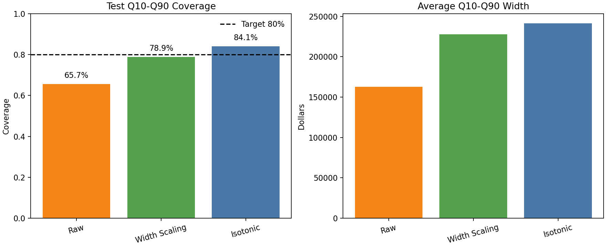
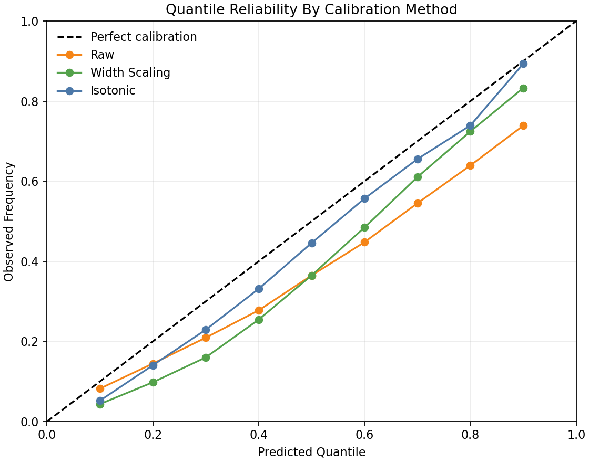

# Calibration Method Comparison

This report compares two calibration approaches:

1. **Width scaling**: widen `Q10` and `Q90` around `Q50` using one validation-selected factor.
2. **Isotonic quantile calibration**: use the validation reliability curve to map desired calibrated quantiles to adjusted raw quantile levels.

All calibration choices are learned on the validation period and evaluated on the untouched test period.

## Method Details

Width scaling selected factor:

```text
1.40
```

Isotonic target-to-raw quantile mapping:

|   target_quantile |   adjusted_raw_quantile_level |
|------------------:|------------------------------:|
|             0.100 |                         0.065 |
|             0.200 |                         0.194 |
|             0.300 |                         0.333 |
|             0.400 |                         0.465 |
|             0.500 |                         0.598 |
|             0.600 |                         0.713 |
|             0.700 |                         0.812 |
|             0.800 |                         0.901 |
|             0.900 |                         0.961 |

## Test Metrics

| method        |   q10_q90_coverage |   target_coverage |   mean_abs_quantile_calibration_error |   average_interval_width |   average_uncertainty_score |   average_offer_to_q50 |
|:--------------|-------------------:|------------------:|--------------------------------------:|-------------------------:|----------------------------:|-----------------------:|
| Raw           |             0.6567 |            0.8000 |                                0.1167 |              162702.2791 |                      0.3076 |                 0.8796 |
| Width Scaling |             0.7893 |            0.8000 |                                0.1030 |              227783.1907 |                      0.4306 |                 0.8650 |
| Isotonic      |             0.8413 |            0.8000 |                                0.0507 |              241141.5982 |                      0.4417 |                 0.8611 |





## Interpretation

- Best method by closeness to 80% interval coverage: **Width Scaling**
- Best method by mean absolute quantile calibration error: **Isotonic**
- Sharpest method among methods with at least 75% coverage: **Width Scaling**

Width scaling is more transparent and preserves the original `Q50` fair-value estimate.
Isotonic calibration is more flexible and can correct nonlinear reliability-curve distortions, but it can also shift the effective quantile levels, including the median.

For this pricing system, the preferred method should balance:

```text
coverage close to 80%
+ low quantile calibration error
+ reasonably narrow intervals
+ explainability for business stakeholders
```

