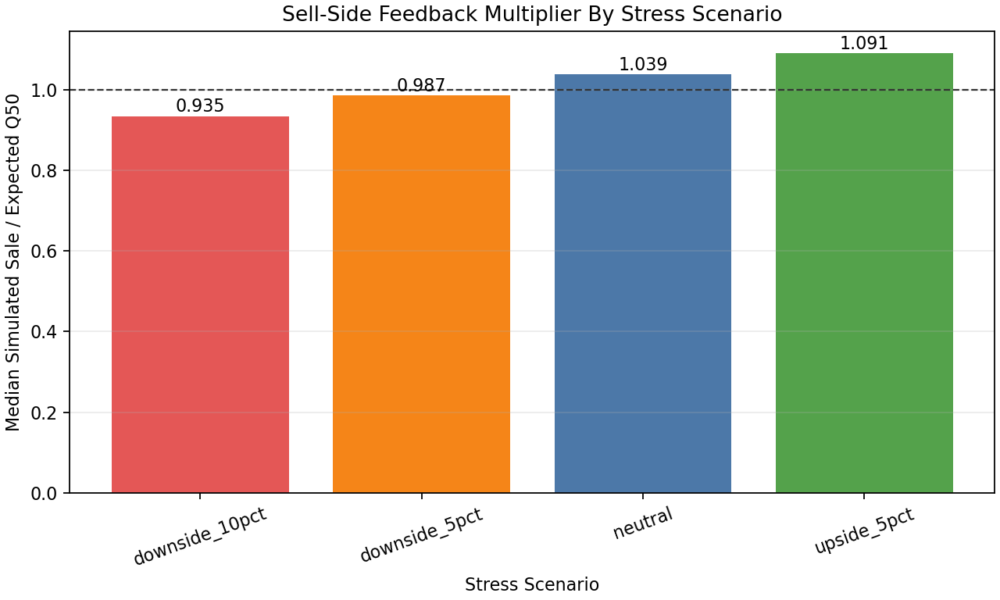
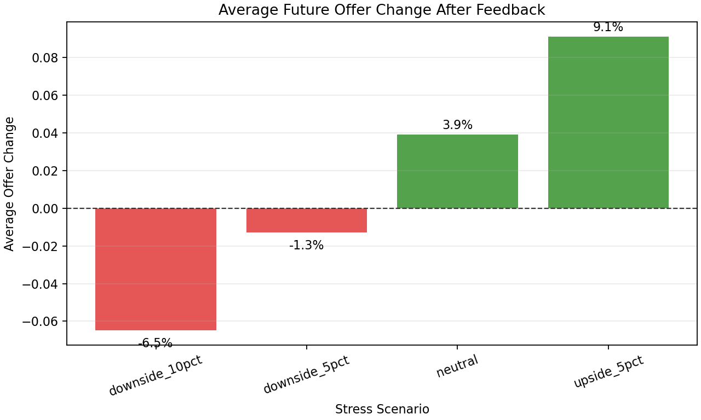
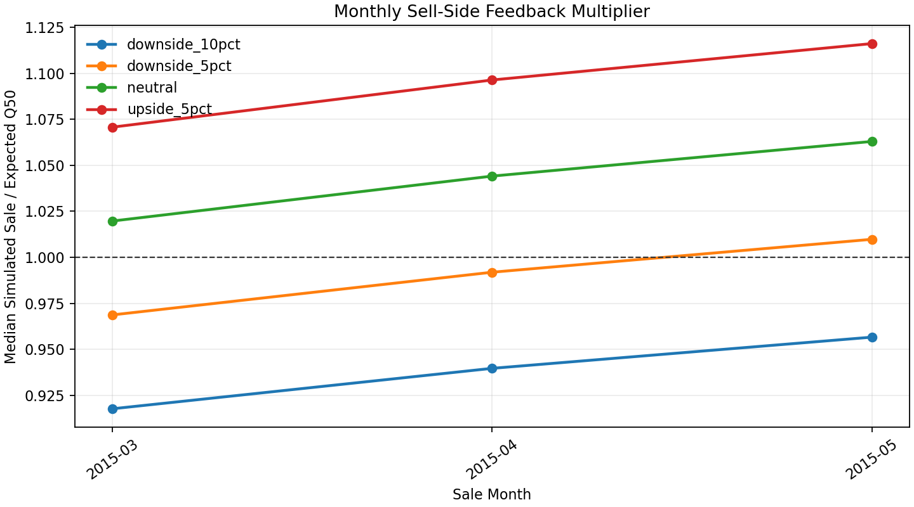
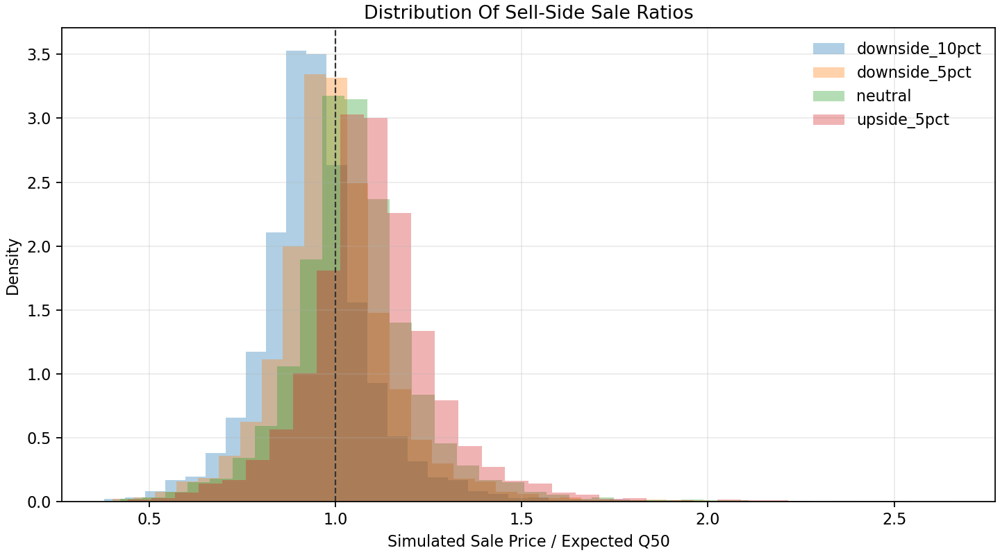

# Sell-Side Feedback Loop Stress Test

This stress test closes the loop between the buy-side AVM and sell-side realized
outcomes.

The feedback rule is identical in every scenario:

```text
simulated_sale_price = actual_test_price * shock_factor
sale_ratio = simulated_sale_price / expected_sale_value_q50
market_multiplier = median(sale_ratio)
future_q10_q50_q90 = current_q10_q50_q90 * market_multiplier
future_offer = offer_engine(future_q10_q50_q90)
```

The shock scenario changes only the observed sell-side outcome. The correction
logic is symmetric: weak sell-side outcomes lower future offers, while stronger
sell-side outcomes raise future offers.

## Scenario Summary

| scenario       |   shock_factor |   market_multiplier | implied_market_bias   |   median_sale_ratio |   mean_sale_ratio | average_original_offer   | average_feedback_adjusted_offer   | average_offer_change   | average_offer_change_pct   | median_offer_change   | median_offer_change_pct   |
|:---------------|---------------:|--------------------:|:----------------------|--------------------:|------------------:|:-------------------------|:----------------------------------|:-----------------------|:---------------------------|:----------------------|:--------------------------|
| downside_10pct |           0.9  |               0.935 | -6.48%                |               0.935 |             0.945 | $463,944                 | $433,898                          | $-30,046               | -6.48%                     | $-25,986              | -6.48%                    |
| downside_5pct  |           0.95 |               0.987 | -1.28%                |               0.987 |             0.998 | $463,944                 | $458,003                          | $-5,941                | -1.28%                     | $-5,138               | -1.28%                    |
| neutral        |           1    |               1.039 | 3.92%                 |               1.039 |             1.051 | $463,944                 | $482,109                          | $18,165                | 3.92%                      | $15,710               | 3.92%                     |
| upside_5pct    |           1.05 |               1.091 | 9.11%                 |               1.091 |             1.103 | $463,944                 | $506,214                          | $42,270                | 9.11%                      | $36,558               | 9.11%                     |





## What We Learn

- In the `downside_5pct` scenario, the market multiplier is `0.987`, producing an average future offer change of `-1.28%`.
- In the `neutral` scenario, the multiplier is `1.039`. This reflects the model's observed test-period bias before any extra shock.
- In the `upside_5pct` scenario, the multiplier is `1.091`, so the same feedback loop can raise future offers when sell-side outcomes are stronger than expected.

The project takeaway is that valuation uncertainty and market bias are handled
separately:

```text
calibrated Q10-Q90 width -> property-level uncertainty spread
sell-side market multiplier -> market-level bias correction
```

## Monthly View

The monthly view is a lightweight version of how this would operate in
production: recent sales update the multiplier that future acquisition offers
use.




