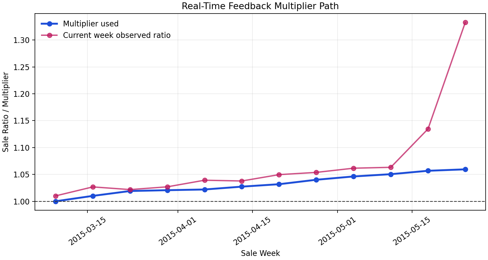
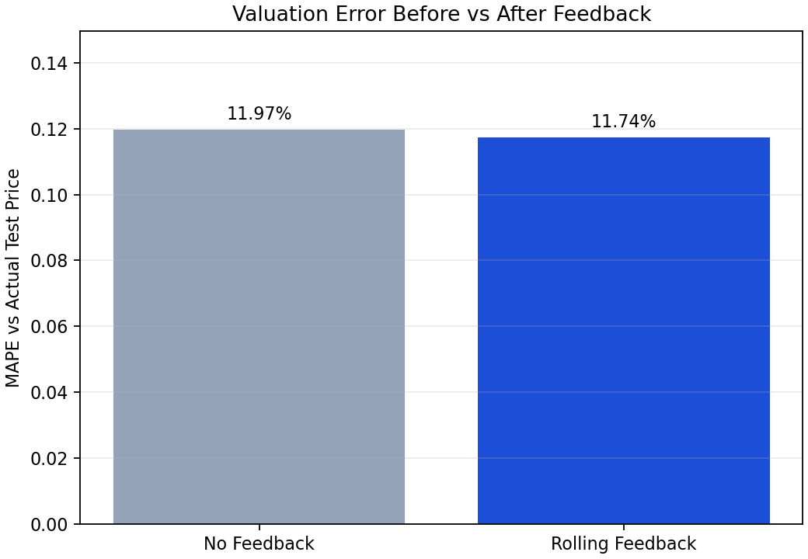
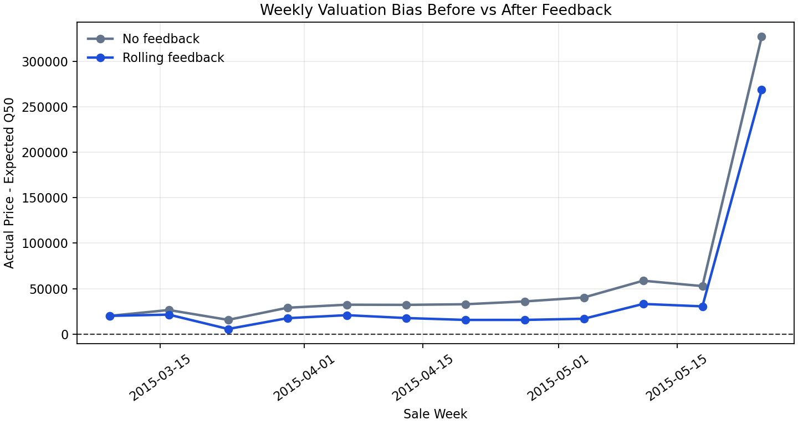
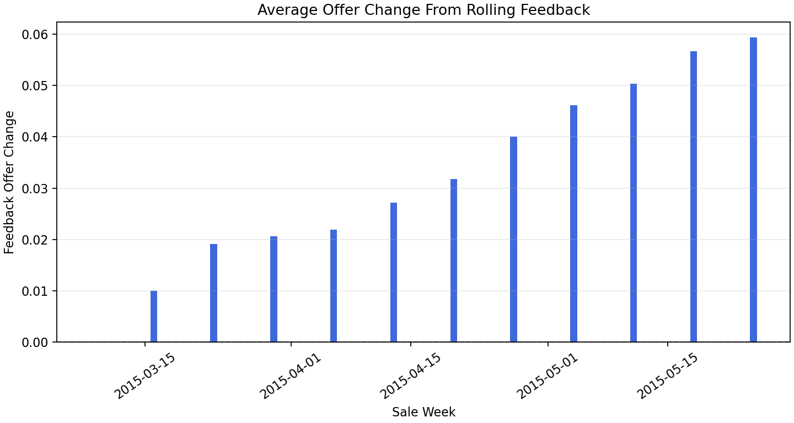
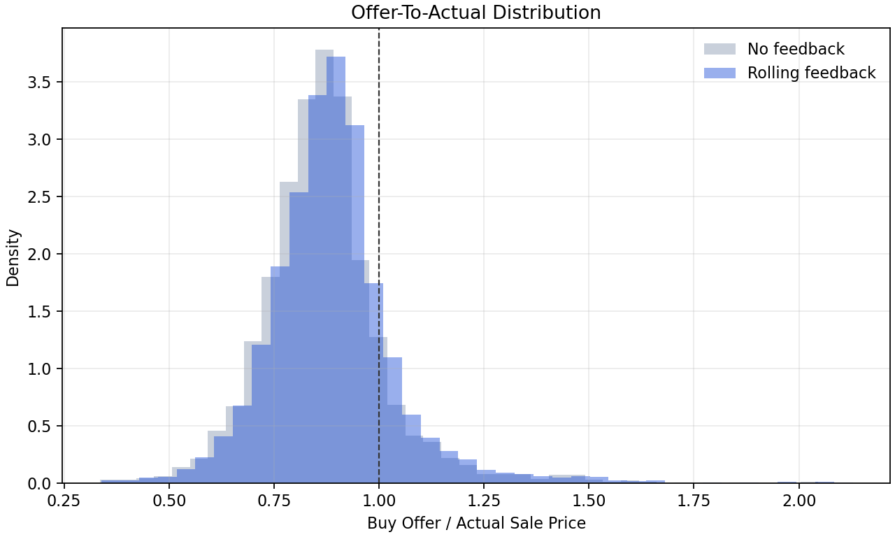
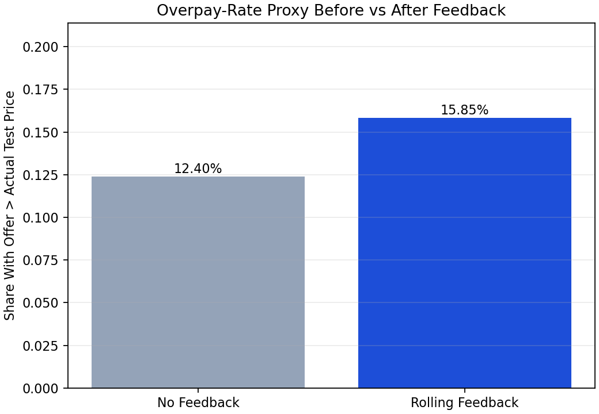
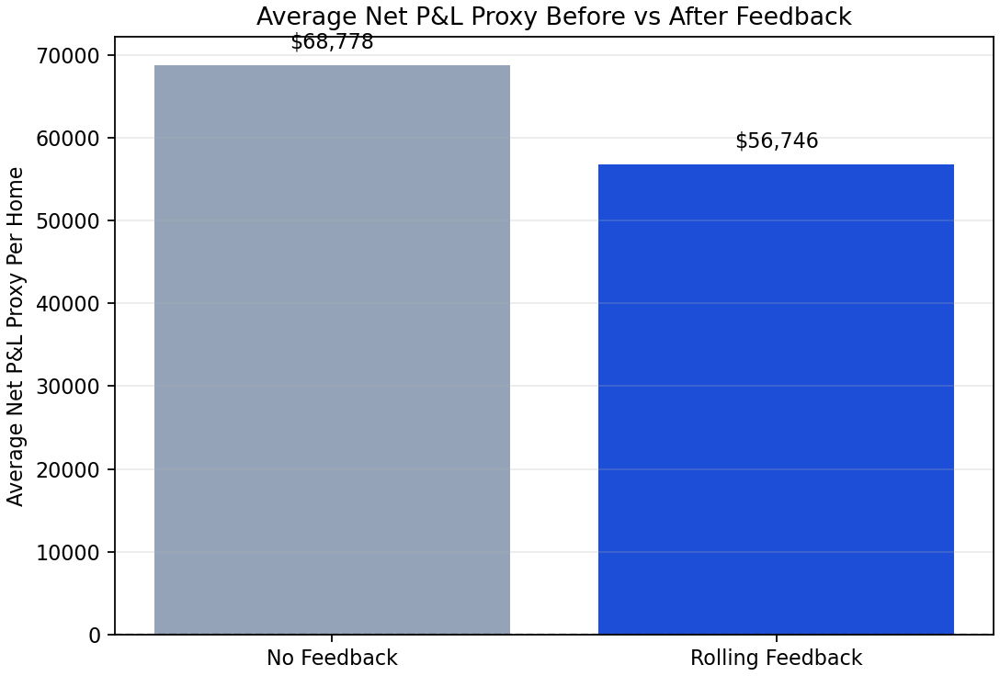
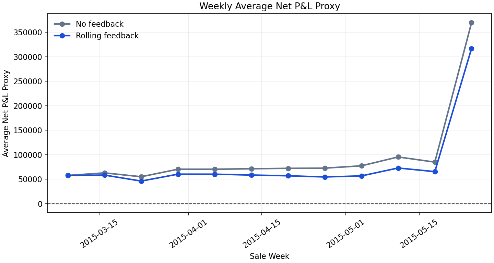
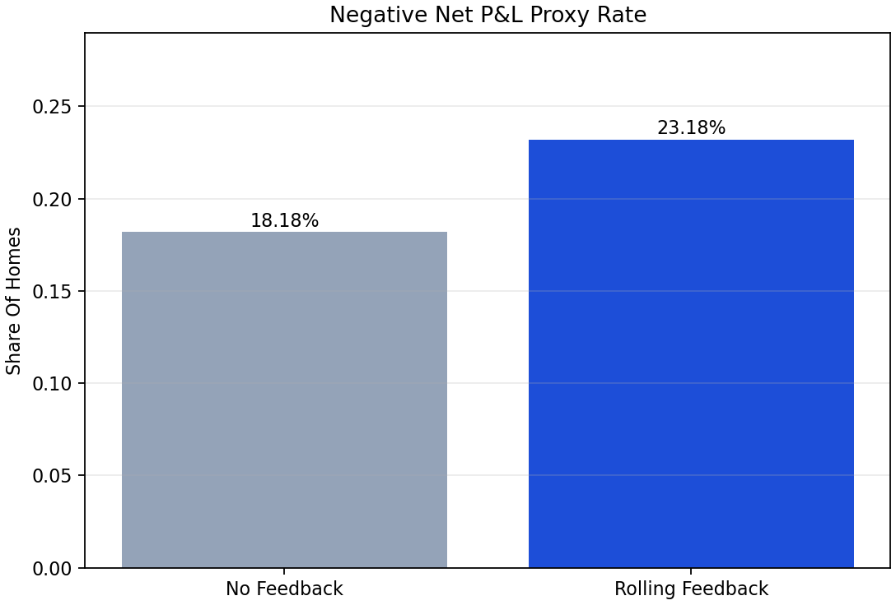

# Real-Time Feedback Backtest

This backtest uses the actual held-out test period only. There are no shock
factors and no simulated market scenarios.

The test period runs from `2015-03-09` to `2015-05-25`. For each sale week,
the feedback system uses a market multiplier estimated only from prior resale
outcomes, so the current week is never allowed to look at its own actuals.

## Feedback Rule

```text
sale_ratio = actual_test_price / expected_q50
rolling_multiplier = median(sale_ratio over prior 4 weeks)
feedback_q10_q50_q90 = calibrated_q10_q50_q90 * rolling_multiplier
feedback_offer = offer_engine(feedback_q10_q50_q90)
```

For the first week, no prior sell-side outcomes exist, so the multiplier starts
at `1.0`. After that, it uses a four-week lookback. This is more stable than
using only the previous week, but still responsive to recent market movement.

## Headline Results

| Metric | No Feedback | Rolling Feedback |
|---|---:|---:|
| MAPE vs actual price | 11.97% | 11.74% |
| Median APE vs actual price | 8.80% | 8.07% |
| Signed bias | $30,632 | $17,033 |
| Offer / actual price | 86.71% | 88.95% |
| Overpay-rate proxy | 12.40% | 15.85% |
| Avg net P&L proxy | $68,778 | $56,746 |
| ROI proxy | 13.96% | 11.07% |
| Negative P&L proxy rate | 18.18% | 23.18% |

Average offer change from feedback:

```text
$12,032 per home (2.60%)
```

Final multiplier used:

```text
1.059
```

## What Happened

The held-out test period was stronger than the model expected, so the feedback
multiplier usually moves above `1.0`. That means the loop raises future offers
instead of lowering them. This is the desired behavior: the loop is correcting
observed market bias, not blindly making offers more conservative.







## Business Impact

The rolling feedback loop changes the customer-facing offer by shifting the
whole calibrated valuation band. It does not change the property-level
uncertainty score directly.







## P&L Proxy

Because the King County dataset does not include realized renovation costs,
holding period, financing costs, concessions, or resale transaction costs, this
is not true acquisition P&L. It is a proxy based on the cost assumptions already used
in the offer engine.

```text
operating_cost_rate = transaction cost + holding cost + resale prep
                    = 4.00%

net_pnl_proxy = actual_sale_price - buy_offer - actual_sale_price * operating_cost_rate
roi_proxy = net_pnl_proxy / buy_offer
```

Target margin is intentionally not treated as a cost. It is the desired profit
cushion.

P&L proxy change from feedback:

```text
Total net P&L proxy change: $-52,013,475
```







## Interpretation

In this actual test period, feedback mainly improves competitiveness and market
alignment because recent sales are clearing above the model's original Q50.
The tradeoff is visible in the P&L proxy: raising offers reduces per-home
cushion and increases negative-P&L risk. In a weaker period, the same mechanism
would push the multiplier below `1.0` and lower future offers.

This gives the project two complementary feedback-loop views:

```text
6_sell_side_feedback_loop.py       -> stress-test scenarios
7_realtime_feedback_backtest.py    -> actual rolling test-period backtest
```
