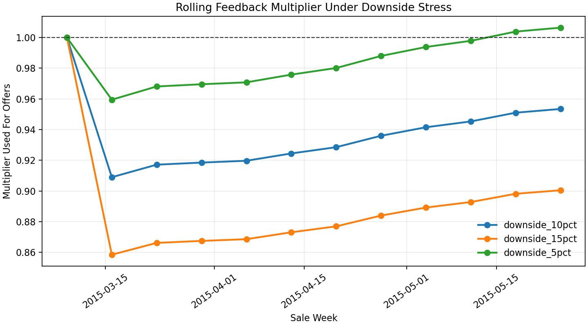
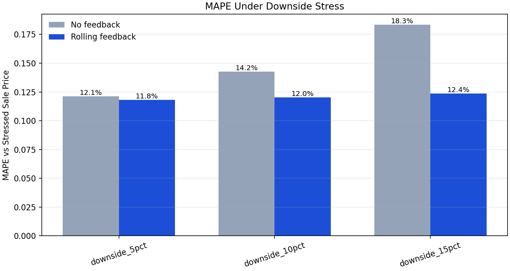
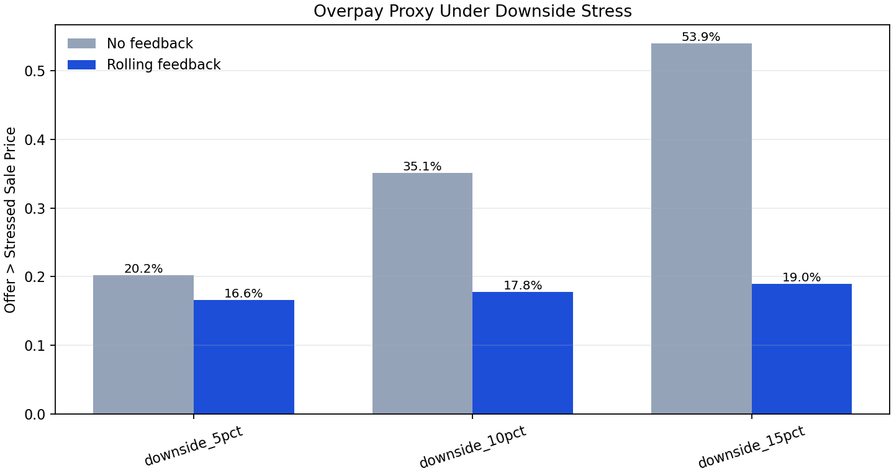
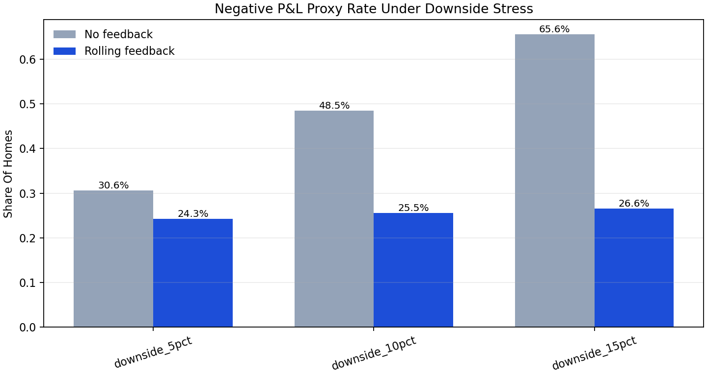
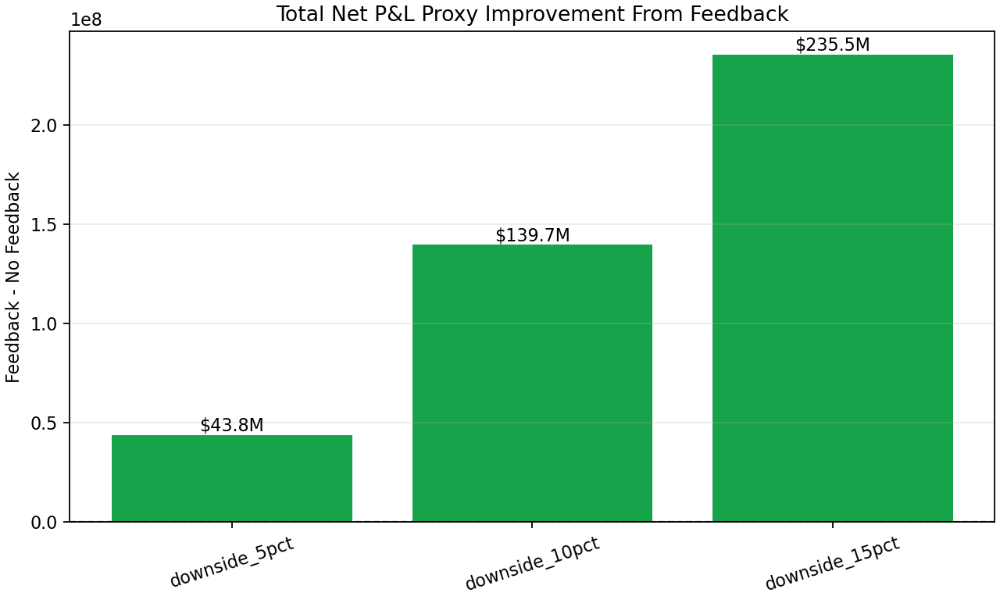

# Downside Stress Feedback Backtest

This report stress-tests the rolling feedback loop under downside resale
conditions. Unlike the actual real-time backtest, this file intentionally
applies downside shocks to observed test prices:

```text
stressed_sale_price = actual_test_price * shock_factor
```

For each stress level, the loop is still realistic in timing: current-week
offers only use market multipliers learned from prior weeks.

```text
sale_ratio = stressed_sale_price / expected_q50
rolling_multiplier = median(sale_ratio over prior 4 weeks)
feedback_q10_q50_q90 = calibrated_q10_q50_q90 * rolling_multiplier
feedback_offer = offer_engine(feedback_q10_q50_q90)
```

## Summary

| scenario       |   shock_factor | baseline_mape   | feedback_mape   | baseline_overpay_rate   | feedback_overpay_rate   | baseline_average_net_pnl_proxy   | feedback_average_net_pnl_proxy   | baseline_negative_pnl_rate   | feedback_negative_pnl_rate   | total_net_pnl_proxy_improvement   |   final_multiplier_used |
|:---------------|---------------:|:----------------|:----------------|:------------------------|:------------------------|:---------------------------------|:---------------------------------|:-----------------------------|:-----------------------------|:----------------------------------|------------------------:|
| downside_5pct  |           0.95 | 12.12%          | 11.82%          | 20.22%                  | 16.63%                  | $42,142                          | $52,282                          | 30.56%                       | 24.27%                       | $43,836,181                       |                   1.006 |
| downside_10pct |           0.9  | 14.25%          | 12.04%          | 35.07%                  | 17.81%                  | $15,506                          | $47,818                          | 48.48%                       | 25.54%                       | $139,685,837                      |                   0.953 |
| downside_15pct |           0.85 | 18.34%          | 12.38%          | 53.94%                  | 18.99%                  | $-11,130                         | $43,354                          | 65.58%                       | 26.60%                       | $235,535,492                      |                   0.901 |

## What We Learn

Under downside stress, the rolling multiplier moves below `1.0`, so future
offers are reduced relative to the no-feedback baseline. This is where the
feedback loop provides downside protection: it cuts overpay risk and improves
the P&L proxy after weak sell-side outcomes become visible.











## Interpretation

The actual rolling backtest showed the feedback loop raising offers because the
test period was stronger than expected. This downside stress test shows the
opposite case: when resale outcomes weaken, the same loop lowers future offers
and protects estimated P&L.

Together, these two analyses show that the feedback loop is directionally
symmetric:

```text
strong sell-side outcomes -> raise future offers for competitiveness
weak sell-side outcomes   -> lower future offers for risk control
```
